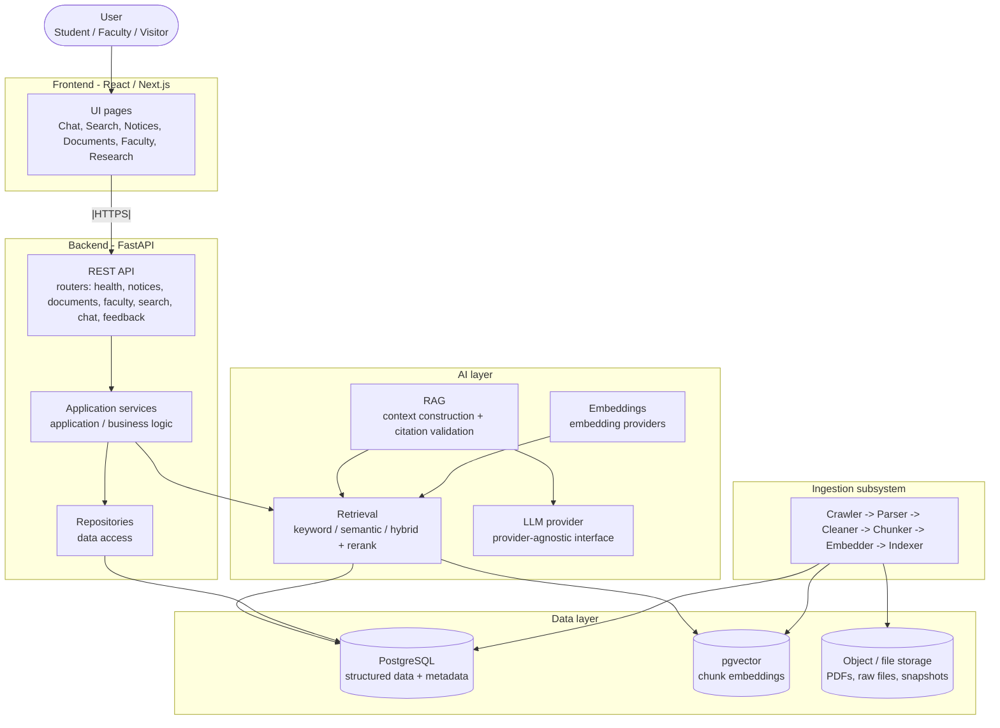

# AMUCS Nexus - Component Diagram

> TARGET ARCHITECTURE - not all components are implemented yet.

## Diagram

## Component responsibilities

| Component | Responsibility | Examples |
|-----------|----------------|----------|
| Frontend | Presentation and client UX | Chat, Search, Notices, Documents, Faculty, Research pages |
| REST API | Exposes resources/operations over HTTP | /api/notices, /api/search, /api/chat |
| Application services | Business logic and orchestration | Query routing, feedback handling |
| Repositories | Data access abstraction | Read/write records from PostgreSQL |
| Ingestion | Acquires and processes source material | Crawl, parse, clean, chunk, embed, index |
| Retrieval | Finds relevant content | Keyword + semantic + hybrid + rerank |
| RAG | Builds evidence-grounded answers | Context construction, citations |
| Embeddings | Turns text into vectors | Index-time and query-time embeddings |
| LLM provider | Generates answers from evidence | Provider-agnostic call |

## Why this shape

- **Single deployable system (modular monolith)**, not microservices. Separating each concern into a deployable service would add networking, deployment, and operational complexity with no current benefit.
- **The AI is one component**, not the whole product. Many use cases (searching notices, opening a PDF) do not need an LLM.
- **A clear data layer boundary** keeps retrieval and application logic separate from storage details.

