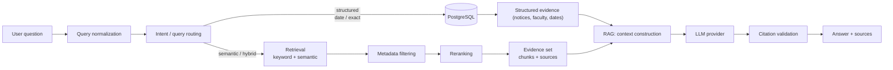
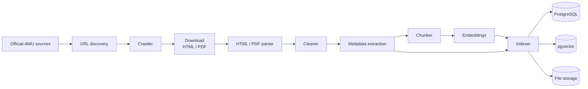

# AMUCS Nexus - Data Flow

> TARGET ARCHITECTURE - not all components are implemented yet.

There are two fundamental data flows:

1. **Request flow** - a user asks for information and receives a source-grounded answer.
2. **Ingestion flow** - official source material is turned into searchable documents and embeddings.

These flows are intentionally independent. Ingestion can happen without any user request, and retrieval works even when no LLM is involved.

## Request flow (query -> answer + citations)

Key points:

- Not every question uses vector search. A structured question ("notices from September") uses date filtering on PostgreSQL, not semantic retrieval.
- Evidence is gathered and passed to the LLM together; the answer must be grounded in that evidence and cite its sources.

## Ingestion flow (source -> indexed)

Key points:

- Documents retain source metadata (URL, dates, document type) so answers can always be traced to an original source.
- The indexer writes structured records to PostgreSQL, embeddings to pgvector, and raw files to object/file storage.

