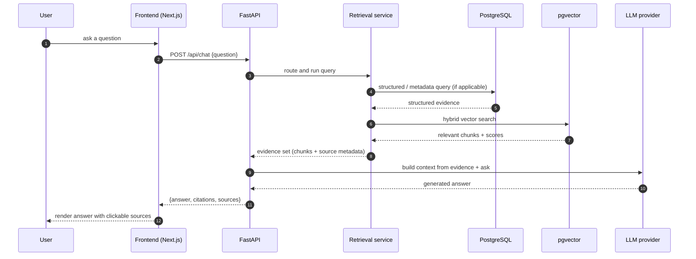
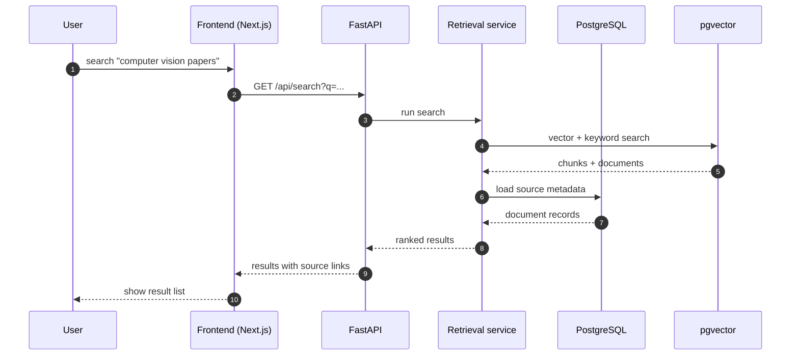
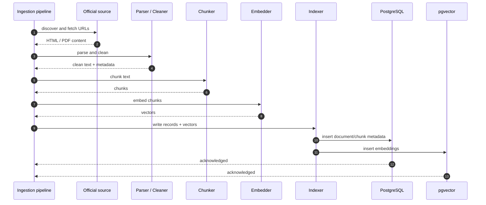

# AMUCS Nexus - Sequence Diagrams

> TARGET ARCHITECTURE - not all components are implemented yet.

Sequence diagrams show the order of messages between components for one scenario.

## Chat / question answering

Notes:

- The retrieval step may be skipped for questions that only need structured data (e.g. a date-filtered notice list).
- The answer always carries citations so the user can open the original source.

## Search (no LLM)

Search is a first-class path that does not require chat.

## Ingestion (one crawl batch)

