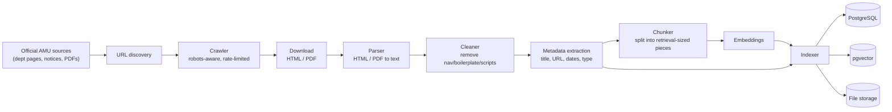

# AMUCS Nexus - Ingestion Flow

> TARGET DESIGN - not implemented yet.

Ingestion turns official source material into searchable, retrievable content. It runs independently of user requests.

## Pipeline

## Stage responsibilities

| Stage | Responsibility |
|-------|----------------|
| URL discovery | Find official pages, notice links, PDFs to process |
| Crawler | Fetch pages respectfully (robots.txt, rate limits) |
| Parser | Convert HTML and PDF into clean text |
| Cleaner | Remove navigation, scripts, and repeated boilerplate |
| Metadata | Capture source_url, title, dates, document_type, department |
| Chunker | Split text into chunks suitable for embedding and retrieval |
| Embedder | Produce vector embeddings for each chunk |
| Indexer | Write structured records + embeddings (+ raw files) |

## Important principles

- **Targeted, not blanket.** We process official and approved sources only, not every page on the internet.
- **Source metadata is preserved** so every chunk can be traced back to an original URL.
- **Dedup and change detection** via content hash to avoid duplicate/outdated documents.
- **Graceful failure:** a failed download or parse must not stop the whole batch.

