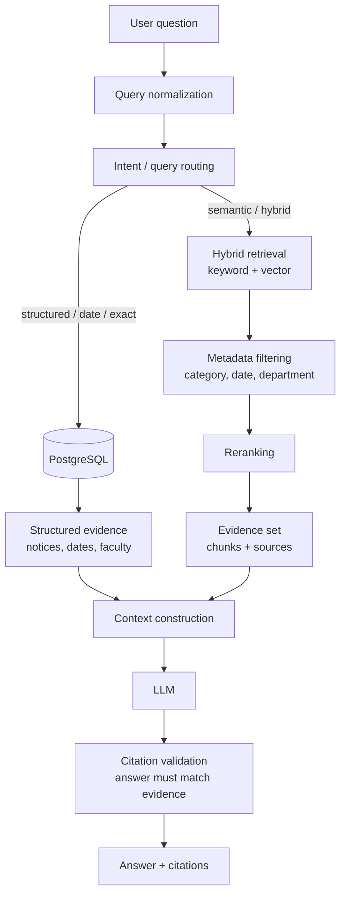

# AMUCS Nexus - RAG Flow

> TARGET DESIGN - not implemented yet.

RAG (Retrieval-Augmented Generation) grounds an LLM answer in retrieved evidence so it does not have to rely on general knowledge and can cite sources.

## Pipeline

## Decisions baked into this design

- **Not every query uses vector search.** Structured/date questions use PostgreSQL filters, which is exact and cheap. Semantic retrieval is reserved for questions that need meaning or synonyms (e.g. "papers about computer vision").
- **Reranking** improves the ordering of retrieved chunks before building context.
- **Citation validation** checks that claims made by the answer are present in the evidence, reducing hallucination.
- **Prefer honesty:** if information is not in the evidence, the answer should say it could not be verified from indexed official sources - never fabricate URLs, dates, or notices.

## Why RAG and not just an LLM

- The LLM only knows what it was trained on; it may be wrong or out of date about AMU specifically, and it can hallucinate.
- By giving it retrieved evidence and asking it to answer and cite only from that evidence, we get verifiable, source-grounded output.

